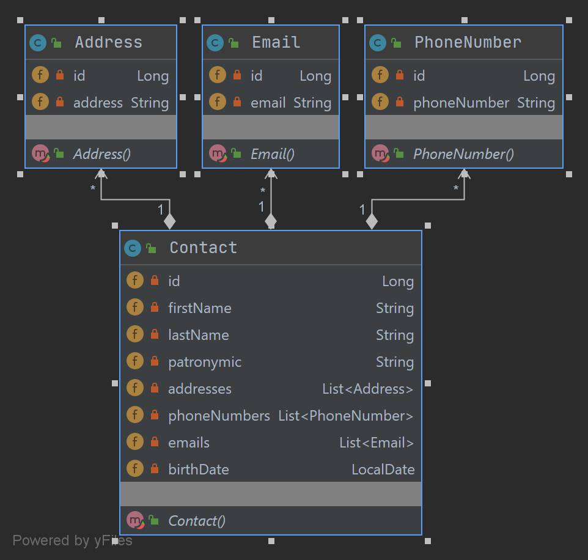
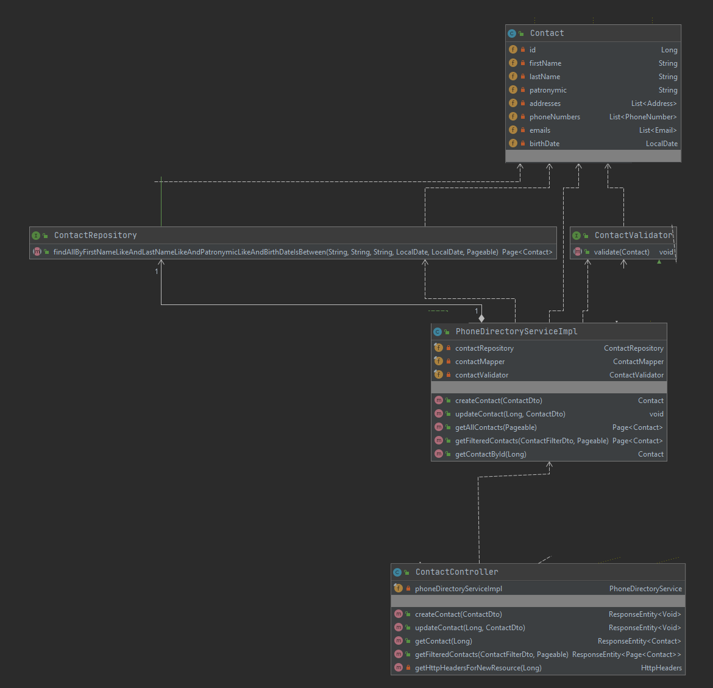
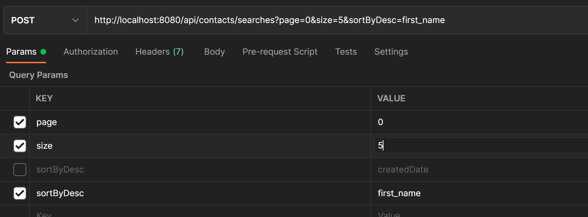
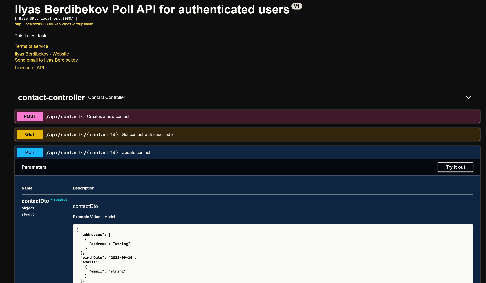

 Task 2 Telephone directory 
 -
 1. Telephone-directory-app - REST application based on Spring boot framework(Spring DataSpring mvc).
   
 1. Database - H2 (with contacts)
    - src\main\resources\import.sql - init database script
 
 1. User functionality
    - create new contact
    - get filtered contacts by first name,second name ,patronymic ,birth date bounds
    - get sorted contacts by request parameter sortByDesc - firstName
    - update contact
    
UML DIAGRAM
-
- Domain    

- Apllication UML
    
    
    
API documentation by Swagger 
-

Lunch application. API documentation will be on http://localhost:8080/swagger-ui/index.html

Compile and run instruction
-
- JDK 14+
- Run from Intellij IDEA.
    - In Intellij IDEA click to project folder->add framework support->Maven.
    - Lunch src\main\java\com\berdibekov\PhoneDirectory.java .

- From Console 
    - Windows
        - run make.bat
        - run dist\app.bat
    - UNIX (Linux,Mac OS)     
        - sh make.sh
        - scripts dist\app.sh
 
 Use instructions
 -
 
 - to sort contacts use json with format as post request body : {"field name":"pattern"}
 ```$xslt
{
  "birthDateAfter": "2021-09-12",
  "birthDateBefore": "2021-09-12",
  "firstNamePattern": "An%",
  "lastNamePattern": "%ov",
  "patronymicPattern": "%vich"
}
```
- or you can specify no parameter ,so it will get all contacts.
 ```$xslt
{
}
```

 Retrieve sorted page of contacts
 
 
 also you can make api request in swagger ui
  
